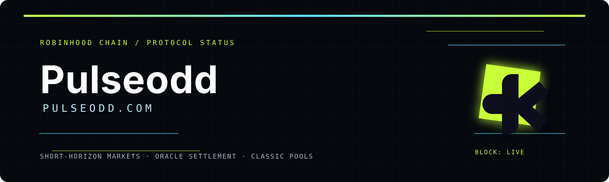

<div align="center">
  
  <h1>Pulseodd</h1>
  <p><strong>pulseodd.com</strong><br />Short-horizon prediction markets with visible oracle settlement on Robinhood Chain.</p>
</div>

<p align="center">
  <a href="https://pulseodd.com">Live Application</a> ·
  <a href="https://pulseodd.com/docs">Technical Docs</a> ·
  <a href="mailto:pulse@pulseodd.com">Support</a>
</p>

Pulseodd is a short-horizon UP/DOWN pooled prediction protocol for Robinhood Chain. The current release is presented as operational on Robinhood Chain, with a planned mainnet launch on **8 October 2026**.

## Mainnet announcement

Pulseodd is preparing for its mainnet release on **8 October 2026**. The launch plan includes verified deployment addresses, oracle and keeper monitoring, treasury controls, a public fee route, and a documented incident-response process.

```text
STATUS        Robinhood Chain product flow operational
MAINNET       8 October 2026
FEE           1% per completed transaction
BUYBACK       80% of collected protocol fees earmarked
TREASURY      20% reserved for operations and infrastructure
TOKEN         0x3E5300c0664Ae607bF0A9A2D84A4aAD6bEbbfB98
```

The date and economic parameters describe the current project plan. Contract bytecode, chain, ownership, permissions, oracle state, and liquidity venue must be independently verified before interacting with any asset.

## Entry experience

The first screen of the web application is a branded 3D identity scene. It combines the lime Pulseodd mark, a perspective-driven logo plate, the `Pulseodd` wordmark, and the `pulseodd.com` domain label before the user launches the market terminal. The implementation lives in [`apps/web/src/components/arrival-scene.tsx`](apps/web/src/components/arrival-scene.tsx) with motion and 3D depth styles in [`apps/web/src/app/globals.css`](apps/web/src/app/globals.css). The static README banner is maintained at [`docs/pulseodd-readme-banner.svg`](docs/pulseodd-readme-banner.svg).

Live entry route: [pulseodd.com](https://pulseodd.com)

## Public token reference

- Token contract address: `0x3E5300c0664Ae607bF0A9A2D84A4aAD6bEbbfB98`
- Planned mainnet launch: `8 October 2026`
- Planned protocol fee: `1%` per completed transaction
- Planned fee allocation: `80%` buyback / `20%` protocol operations and treasury

These values describe the current project plan. Verify chain, contract bytecode, ownership, and deployment state before interacting with any contract.

The product opens in a visual market scene and transitions into the Classic pool terminal at `/classic`.

## Structure

- `packages/contracts`: Foundry contracts and fork-less unit tests.
- `apps/web`: Next.js 15 App Router UI with RainbowKit, wagmi, viem, Tailwind, and demo mode.
- `packages/sdk`: Shared asset config and ABI fragments.
- `scripts/keeper`: viem keeper that locks, settles, and creates looping rounds.

## Environment

Copy `.env.example` to `.env.local` for the web app and `.env` for deploy/keeper usage.

Important variables:

- `RH_CHAIN_ID`: Robinhood Chain chain id. Testnet: `46630`; mainnet: `4663`.
- `RH_RPC_URL`: Robinhood Chain RPC endpoint.
- `RH_EXPLORER_URL`: Robinhood Chain explorer base URL.
- `RH_TOKEN_ADDRESS`: `0x0000000000000000000000000000000000000000` for native ETH, or an ERC20 address.
- `PREDICT_CONTRACT`: deployed `PredictClassic`.
- `ORACLE_CONTRACT`: deployed oracle adapter.
- `TREASURY`: deployed treasury.
- `KEEPER_PRIVATE_KEY`: backend/keeper only. Do not expose it to the frontend.
- `NEXT_PUBLIC_DEMO=1`: run `/classic` with mock data.
- `NEXT_PUBLIC_WALLETCONNECT_PROJECT_ID`: your WalletConnect Cloud project id, required for QR/mobile wallet connections.

### RPC behavior

The previous `rpc.rh.network` value was only a placeholder and is not used. The default wallet network is Robinhood Chain infrastructure configured through environment variables. The historical testnet defaults are chain ID `46630`, RPC `https://rpc.testnet.chain.robinhood.com`, explorer `https://explorer.testnet.chain.robinhood.com`, and `ETH` for gas.

To use mainnet, set `NEXT_PUBLIC_RH_CHAIN_ID=4663`, `NEXT_PUBLIC_RH_RPC_URL=https://rpc.mainnet.chain.robinhood.com`, and the mainnet explorer URL. TODO(RH): only change chain values from official Robinhood Chain documentation.

The Robinhood Chain testnet faucet is available at `https://faucet.testnet.chain.robinhood.com`. Testnet ETH only pays gas; it is not a production asset.

## Contracts

```bash
forge test --root packages/contracts --offline
```

Deploy order:

1. Deploy `Treasury`.
2. Deploy `PriceOracleAdapter`.
3. Deploy `PredictClassic` with ETH or ERC20 payment mode, oracle, treasury, min stake, and max stake.
4. Set oracle relayer with `PriceOracleAdapter.setRelayer`.
5. Set keeper with `PredictClassic.setKeeper`.
6. Create first rounds for `BTC` on `60` and `300`.

Placeholder deploy script:

```bash
forge script packages/contracts/script/DeployRH.s.sol:DeployRH \
  --root packages/contracts \
  --rpc-url "$RH_RPC_URL" \
  --broadcast
```

For a local/testnet play-money token, deploy `MockERC20` and use its address as `RH_TOKEN_ADDRESS`.
It mints deliberately valueless `tUSDC` test credits; each wallet can call `claimFaucet()` once to receive `1,000 tUSDC`.

## Web

```bash
npm install
npm run dev:web
```

Open `/classic`. With `NEXT_PUBLIC_DEMO=1`, the UI uses mock pools, positions, live feed, and round history. Settlement is always intended to use the on-chain oracle, never the TradingView/Binance chart.

For a wallet-connected test flow, provide `NEXT_PUBLIC_RH_TOKEN_ADDRESS` for the deployed `MockERC20` and `NEXT_PUBLIC_PREDICT_CONTRACT` for `PredictClassic`. Every wallet can then claim its faucet allocation once and use the same token for bets. In demo mode, the screens stay functional without sending a transaction.

## Keeper

```bash
npm --workspace scripts/keeper run dev
```

The keeper reads the BTC current round every 2 seconds for 60s and 5m timeframes:

- calls `lockRound` after `lockTs`,
- calls `settleRound` after `endTs`,
- calls `createNextRound` when no active round exists or the last one settled.

## Product Notes

- Default tie behavior is refund with no fee.
- Planned mainnet protocol fee is 1% of completed transactions; 80% is earmarked for buybacks and 20% for operations and treasury.
- Users may place multiple bets in the same round; positions are accumulated per round.
- `claim()` is the default payout flow. Emergency refunds are available only while paused.
